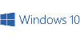

# Conversor de Monedas

## Descripción

Este programa te permite convertir fácilmente cantidades de una moneda a otra. Con una interfaz intuitiva y sencilla de usar, podrás realizar conversiones en segundos y mantener un historial de tus operaciones.

## Tecnologías Utilizadas

- **Sistema Operativo:** Windows 10 
- **Entorno de Desarrollo Integrado (IDE):** Intellij IDEA ver. 241.15989.150 
- **JDK de Java:** 17.0.11 
- **Biblioteca:** Gson 2.10.1 
- **API de Tasa de Cambio:** ExchangeRate-API 

## Características Principales

- **Interfaz Amigable:** La interfaz gráfica del programa es intuitiva y fácil de usar. Solo necesitas seleccionar las monedas de origen y destino, ingresar la cantidad y hacer clic en "Convertir".

- **Amplia Variedad de Monedas:** El programa cuenta con una amplia variedad de monedas de todo el mundo, por lo que podrás convertir entre cualquier par de monedas disponibles.

- **Historial de Conversiones:** Mantén un registro de todas tus conversiones. Puedes ver el historial en cualquier momento para consultar las operaciones previas.

## Cómo Usar el Programa

### Ventana Principal

Al ejecutar el programa, aparecerá una ventana titulada "Conversor de Monedas".

### Seleccionar Monedas

Usa los menús desplegables para seleccionar la moneda base y la moneda destino.

Ejemplo: Selecciona "USD - Dólar estadounidense" como moneda base y "COP - Peso Colombiano" como moneda destino.

### Ingresar Cantidad

Introduce la cantidad de la moneda base que deseas convertir en el campo de texto "Cantidad".

Ejemplo: Ingresa "100" en el campo de texto "Cantidad".

### Convertir Moneda

Haz clic en el botón "Convertir" para realizar la conversión. Si ingresaste "100" y seleccionaste USD a COP, aparecerá un cuadro de diálogo con el resultado de la conversión.

### Debes tener presente

- Si haces clic en el botón "Convertir" sin ingresar ningún valor en el campo de "Cantidad", aparecerá un cuadro de advertencia con el mensaje "Por favor, ingresa un valor en el campo de cantidad".

- Si ingresas en el campo "Cantidad" un valor no numérico (por ejemplo, "abc"), aparecerá un cuadro de error con el mensaje "Por favor, ingresa solo números y la coma para decimales".

### Mostrar Historial

Si deseas ver el historial de las conversiones realizadas, haz clic en el botón "Mostrar Historial" para ver las conversiones realizadas anteriormente en el área de texto.

### Ocultar Historial

Si ya no deseas ver el historial de las conversiones realizadas, haz clic en el botón "Ocultar Historial". El área de texto se vaciará y no mostrará ninguna conversión anterior. Ten presente que esta acción no borrará los registros.

